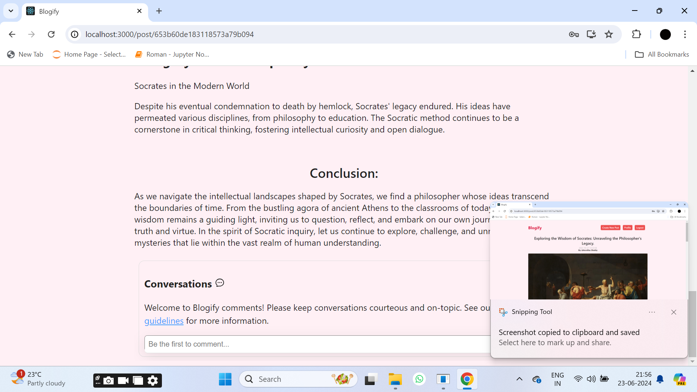

# Blog Website

This Blog Website is a comprehensive platform for users to create, manage, and engage with blog posts. The application provides a seamless experience for users to register, login, create new posts, edit existing ones, and manage their profiles. It is built using modern web technologies and follows best practices in web development.

## Overview

The Blog Website offers a user-friendly interface for managing blog posts. It includes features such as user authentication, CRUD operations on posts, profile management, and a search feature to find specific posts. The application is designed to be responsive and works well across different devices.

## Features

1. **User Registration and Authentication**:
   - Users can sign up with their email and password.
   - Secure login mechanism to ensure user data protection.

2. **CRUD Operations on Posts**:
   - Users can create, read, update, and delete their posts.
   - Posts can include text, images, and other multimedia content.

3. **Profile Management**:
   - Users can update their profiles with personal information and profile pictures.
   - Profile pages display user information and a list of their published posts.

4. **Search Feature**:
   - Users can search for posts by title or content keywords.
   - Search results are displayed in real-time, providing instant feedback to users.

## Screenshots

1. **Home Page**
   
   The home page of the Blog Website displays a list of blog posts with pagination.

2. **Login Page**
   
   Users can log in to their accounts using their email and password.

3. **Register Page**
   
   New users can register for an account by providing their email and creating a password.

4. **Create New Post**
   
   Users can create new blog posts by entering a title, content, and optional image.

5. **Edit Profile**
   
   Users can edit their profile information, including name, email, and profile picture.

6. **Comments Section**
   
   Users can engage with posts by commenting on them, fostering discussion and interaction.

7. **Only Read Others' Posts**
   
   Users can only read posts created by other users without editing them.

8. **Posts Data in MongoDB**
   
   The application stores blog post data in MongoDB, ensuring data persistence and scalability.

9. **Profile Management**
   
   Users can manage their profiles, including updating information and viewing their posts.

10. **Search Feature**
    
    Users can search for specific posts by entering keywords in the search bar.

11. **Update Existing Posts**
    
    Users can update their existing posts with new content or edits.

12. **Update Existing Posts 2**
    
    Another view of the post update feature, showcasing the user-friendly interface.

13. **Server**
    
    The server-side of the application handles requests, database operations, and business logic.x

## Technologies Used

### Frontend

- **React**: JavaScript library for building user interfaces.
- **CSS**: Styling language for designing the layout and appearance of the website.
- **React Router**: Library for routing in React applications.
- **Context API**: For managing global state and user authentication.
- **Axios**: Promise-based HTTP client for making API requests.

### Backend

- **Node.js**: JavaScript runtime for building server-side applications.
- **Express**: Web application framework for Node.js.
- **MongoDB**: NoSQL database for storing user data and blog posts.
- **Mongoose**: Object Data Modeling (ODM) library for MongoDB and Node.js.
- **JWT**: JSON Web Tokens for user authentication and authorization.
- **Multer**: Middleware for handling file uploads.

## How to Run the Project

1. **Clone the repository:**

    ```bash
    git clone https://github.com/vasanthsai14/Blog-Website.git
    ```

2. **Navigate to the project directory:**

    ```bash
    cd Blog-Website
    ```

3. **Install dependencies:**

    ```bash
    npm install
    npm start
    ```

4. **Start the server:**

    ```bash
    cd api
    npm install
    npx nodemon index.js
    ```

5. **Open your web browser and go to [http://localhost:3000](http://localhost:3000) to view the application.**

## License

This project is licensed under the MIT License.
