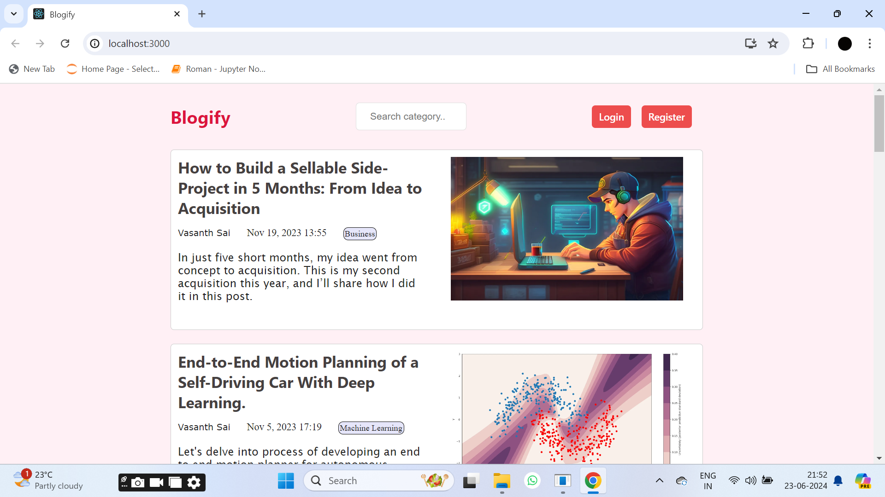

## Blog Website

This Blog Website is a comprehensive platform for users to create, manage, and engage with blog posts. The application provides a seamless experience for users to register, login, create new posts, edit existing ones, and manage their profiles. It is built using modern web technologies and follows best practices in web development.

## Overview

The Blog Website offers a user-friendly interface for managing blog posts. It includes features such as user authentication, CRUD operations on posts, profile management, and a search feature to find specific posts. The application is designed to be responsive and works well across different devices.

## Features

1. **User Registration and Authentication**:
   - Users can register with their email and password.
   - Secure login mechanism using JWT authentication for user data protection.
   - User-friendly error handling for registration and login processes.

2. **CRUD Operations on Posts**:
   - Users can create, read, update, and delete their posts.
   - Rich text editor for creating and editing posts with formatting options.
   - Image upload functionality for adding images to posts.

3. **Profile Management**:
   - Users can update their profiles with personal information, including name, bio, and profile picture.
   - Profile pages display user information and a list of their published posts.
   - Edit profile feature allows users to modify their profile details.

4. **Search Feature**:
   - Users can search for posts by title or content keywords.
   - Real-time search functionality with auto-suggestions for enhanced user experience.
   - Advanced search filters for refining search results based on categories, tags, or dates.

5. **Read Other Posts**:
   - Users can browse and read posts published by other users.
   - Access to a wide range of content across different categories and topics.
   - Bookmark feature to save favorite posts for future reference.

6. **Logout**:
   - Secure logout mechanism to end the user session and clear authentication tokens.
   - Option to log out from any device for improved security.

## Tech Stack

- **Frontend**:
  - React.js: Frontend framework for building user interfaces.
  - HTML, CSS, JavaScript: Core web technologies for markup, styling, and interactivity.
  - React Router: Library for routing and navigation in React applications.
  - Axios: HTTP client for making API requests to the backend server.

- **Backend**:
  - Node.js: Server-side JavaScript runtime environment.
  - Express.js: Web application framework for Node.js.
  - MongoDB: NoSQL database for storing user data and blog posts.
  - Mongoose: MongoDB object modeling tool for Node.js applications.
  - JWT (JSON Web Tokens): Standard for secure authentication tokens.
  - Multer: Middleware for handling file uploads

- **Authentication**:
  - bcrypt.js: Library for hashing passwords securely.
  - JSON Web Tokens (JWT): Tokens used for user authentication and authorization.

- **Deployment**:
  - MongoDB Atlas: Cloud-based database service for MongoDB.
  - GitHub: Version control and collaboration platform for code hosting.

## Screenshots

### Frontend: React app


### Home Page


### Register Page


### Login Page


### Server


### Search Feature on Main Index Page


### CRUD Posts: User can edit, delete only their posts


### Only Read Other Posts: User can just read other content


### Create New Post


### Update Existing Posts


### Update Existing Posts 2


### Profile Management


### Edit Profile


### User Data in MongoDB


### Posts Data in MongoDB


## How to Run the Project

1. **Clone the repository:**

    ```bash
    git clone https://github.com/vasanthsai14/Blog-Website.git
    ```

2. **Navigate to the project directory:**

    ```bash
    cd Blog-Website
    ```

3. **Install dependencies:**

    ```bash
    npm install
    npm start
    ```

4. **Start the server:**

    ```bash
    cd api
    npm install
    npx nodemon index.js
    ```

5. **Open your web browser and go to [http://localhost:3000](http://localhost:3000) to view the application.**

## License

This project is licensed under the MIT License.
